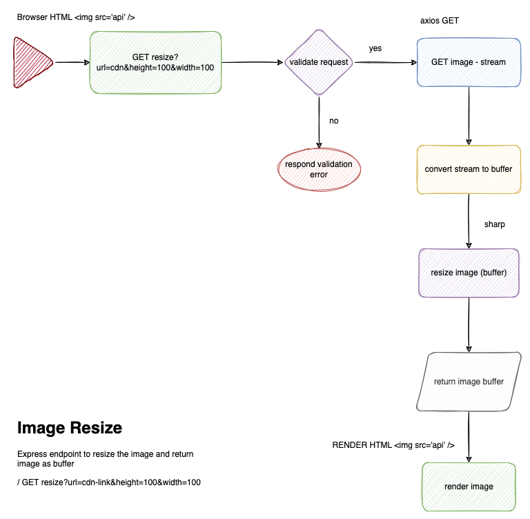

# CloudCorp Image Resize - On Demand

## About the API
A service that exposes an API implementing an on-demand resize transformation.
## Flow chart


## Installation

To make the application run, we have to install the dependencies by running the following script. 

1. Install dependencies - Run the bash script ```sh ./script/npm.install.sh``` 
2. Run the API - ``` npm run start ```

If it asking for permissions then please run the following command before running the bash script.
```
chmod +x ./script/npm.install.sh
```
### Execute a sample request
If developer is using VSCODE with REST client plugin, we can use REST/resize.http file to make sample request.

### Assumptions
- User will make a GET call to api.domain.com/timer?url=valid-cdn-link&height=100&width=100
- User will pass valid image url along with height and width

### About project
- Express, Sharp
- Express-validator
### Feedback
Please feel free to share feedback jitesh.srivastava@gmail.com
